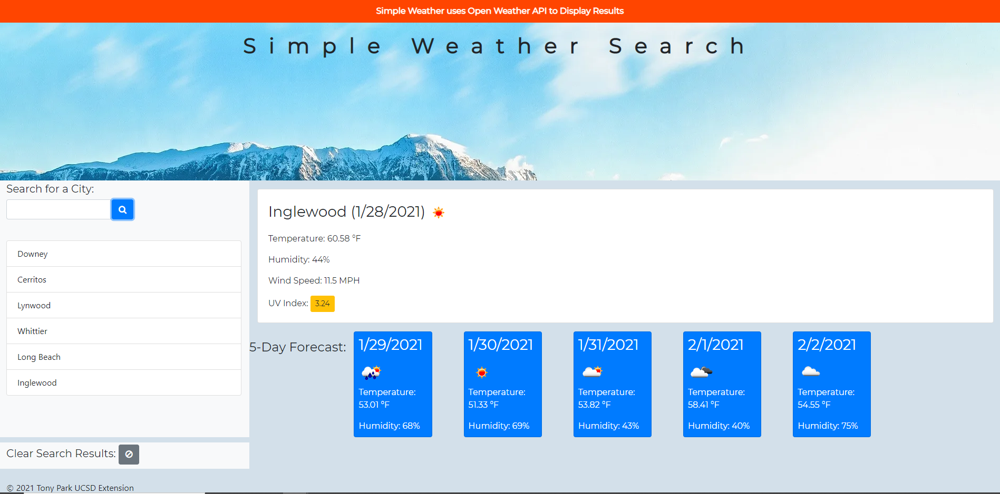

# 06 Server-Side APIs: Weather Dashboard

Try the Weather App at this link: https://tonyrpark.github.io/06-Server-Side-API-TonyPark/

# Files

---

# Main files:

1. index.html
2. assets/css/styles.css
3. assets/js/script.js

---

## Weather Search Elements

- Uses Open Weather API (Tony's API key is hardcoded in, future development can allow user to input key)
- Search with city name only (example: Los Angeles) 
- Retains search history through localStorage
- Adds 5 day forecast, temperature, humidity, wind speed, uv index

### Screenshots

© Tony Park 2021
